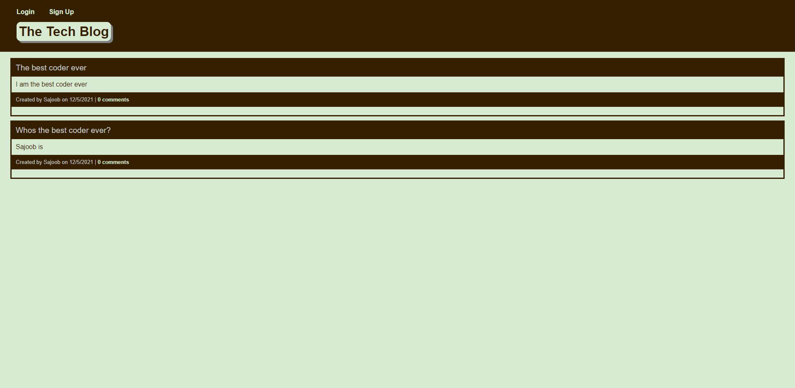

# Tech-Blog

## Description
Tech Blog is a web application where users can post and comment about technology. If users are not logged in however, they may still view all posts.

## Built With
* JavaScript
* Node.js
* SQL
* Sequelize
* Express

## Website
https://tech-blog11199.herokuapp.com/

## Preview

## Table of Contents
* [Installation](#installation)
* [Usage](#usage)
* [License](#license)
* [Contributing](#contributing)
* [Questions](#questions)

## Installation
To install the application, follow these instructions:
Clone the [repository](https://github.com/Ahmed-Sajjad111/E-Commerce-Back-End) to your local files, and install [Node.js](https://nodejs.org/en/)

## Usage
Open application with any command prompt interface that you prefer and type in "npm install". Create a .env file with the variables "process.env.DB_NAME, process.env.DB_USER, process.env.DB_PW" After all the packages are installed, connect to the database run mysql -u root -p and enter password from .env file. Then source the schema.sql by typing in "source schema.sql". To connect to the server run "npm start".

## License
This project is licensed under [MIT](https://opensource.org/licenses/MIT)

## Contributing
[Contributer Covenant Code of Conduct](https://www.contributor-covenant.org/version/2/1/code_of_conduct/)

## Questions
If you have any questions you may reach me at:

Email: uasajjad11198@outlook.com

Github: [Ahmed-Sajjad111](https://github.com/Ahmed-Sajjad111/)